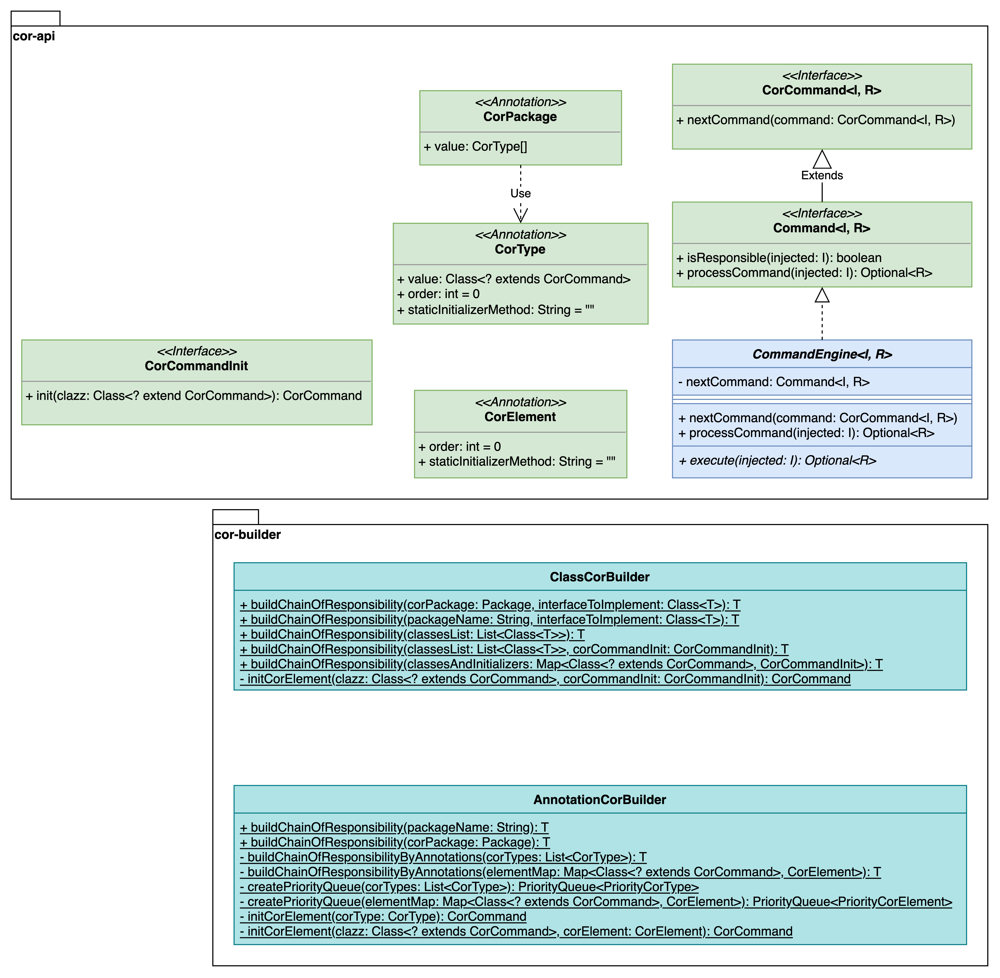

# Chain of Responsibility

## Intent

The chain of responsibility is a behavioral design pattern, that lets pass a value (object) along a chain of objects
(elements). This is a small library to provide the basic interfaces and abstractions that are useful to implement the
chain of responsibility.

When it comes to building up the chain, a builder would be useful to avoid boilerplate code. So the provided builder
initializes all objects of the chain itself or lets you customize the order and even the initialization if needed.

## Features

- API package
    - including _CommandEngine_ abstraction that implements the chain
    - contains interfaces to implement by the elements of the chain
- Builder package
    - Annotation based builder
    - Class based builder

## Java Version

This project bases on Java 17. So you need also Java 17 when using the JAR. Java 17 is the latest LTS release and
language element >Java 11 are used. If you need a Java 11 compatible implementation, feel free to ask.

## Examples

Examples how to use the cor-api and cor-builder artifacts are available in the following github repo:

https://github.com/mcallitea/ChainOfResponsibility-Examples

## Basics
The chain of responsibility pattern is a behavioral pattern. If you have seen or maybe implemented multiple conditions 
that check the instance of a single object, or a switch-case with more than five cases that do the same but only assign
different values this might be a case to use a chain of responsibility. In short words: Every use case, that comes with
different values that must be handled by different implementations / classes, and the only way seems to handle this with 
heavy management code to consider which implementation is the one needed, a chain of responsibility might be a possible 
solution.

The implementation is quite simple. The main part are two interfaces - the _CorCommand_ and _Command_ interfaces. These
two interfaces defined three methods summed to chain the elements, check if a single element is responsible for a given
object and to process a single element. The processing and chaining is done by the abstraction of _CommandEngine_. So 
a concrete implementation of an element only have to check if it's responsible and to execute the operation, whatever 
the operation might be.
The API also provides a _CorCommandInit_ lambda interface, which will be used to inject a constructor-call to the builder.

### Implementing your own chain of responsibility
To implement your own chain, you can make use of extending the _CommandEngine<I, R>_. This is the easiest and most 
convenient way, because chaining and also checking for responsibility and call for processing (if the element is 
responsible) is already done. Extending CommandEngine<I, R> means to implement the _isResponsible(injected: I)_ and the 
_execute(injected: I)_ methods.

Additionally, you can make use of one of the Builder of the _cor-builder_ artifact. Using the _AnnotationCorBuilder_ and 
the use of the _CorPackage_ and _CorType_ annotations is the recommended way to initialize the chain.

## Jakarta EE or Java EE in combination with the ClassesReader

In a Java EE or Jakarta EE context the _ClassesReader_ uses the _VirtualJarInputStream_ of _jboss-vfs_. In any other
case the input stream will be a ByteInputStream to read the classes as resources.

**Important hint** (only if the _ClassesReader_ class is used): The usage of ClassesReader leads to the fact, that
unit-test-cases and also the production release work properly, but different code will be executed. So if it is
important for your work, that the exact same code is executed, a component-test of your Jakarta EE application is
recommended. As written in brackets, this is only the case if you are using the _ClassesReader_ class. If you are using
_CorBuilder.buildChainOfResponsibility(String packageName, Class<T> interfaceToImplement)_ the
_ClassesReader_ class is used per default. Alternatively you can use the annotation way and implement the configuration
by class-annotation or package-annotation.
